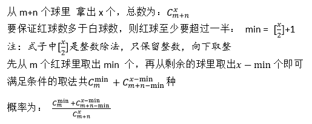

## 概率问题
```
某个袋子中有红球m个，白球n个，现在要从中取出x个球。
那么红球数目多于白球的概率是多少呢？

输入包含三个整数m,n,x，分别表示（红球、白球以及要取出的数目），用空格隔开。
输入包含多组测试，当m,n,x都为0时输入结束
输出占一行，表示红球数目多于白球的概率，结果保留4位小数

输入样例：
2 3 3
2 3 4
0 0 0
输出样例：
0.3000
0.0000
```
```
红球多余白球 <=> 取出的红球个数至少是min = x/2 -1个
注意是计算机的除法，无论x是奇数还是偶数都对
```
先看看如下分析：<br><br>

<br><br>
`可惜这个不符合题意，每次取球都可能是白球或红球，不能先取出min个红球`<br>
考虑每一次取球的情况，用上递归，有两种情况：<br>
```
1. 第一次取出的是红球，概率：m / (m + n)
2. 第一次取出的是白球，概率：n / (m + n) 
```
对于1
```
p(m, n, x) = [m / (m + n) ] * p(m-1, n, x-1)
```
对于2
```
p(m, n, x) = [n / (m + n) ] * p(m, n-1, x-1)
```
所以总的概率是：
```
p(m, n, x) = [m / (m + n) ] * p(m-1, n, x-1) + [n / (m + n) ] * p(m, n-1, x-1)
```
考虑递归的退出条件，为了好判断，我们在p函数增加一个变量leastM，代表至少取出红球的数目

详细实现见d.go
